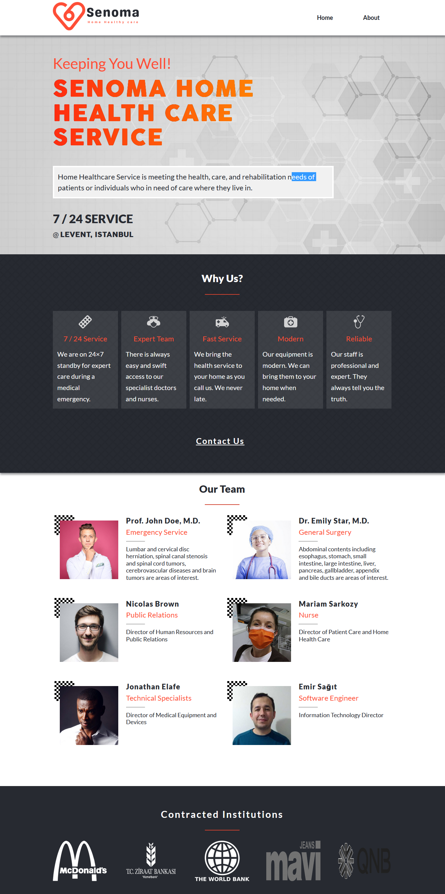

# Home Health Care Center Landing Page

> This is a home health care center landing page. The website contains two pages, the home page and, the about us page. Design idea by [Cindy Shin](https://www.behance.net/gallery/29845175/CC-Global-Summit-2015) in Behance.

## Built With

- HTML & CSS (Sass) & JavaScript
- Used Linters(Lighthouse, stylelint, Webhint)

## Icons

- I used Icons from [Flaticon](https://www.flaticon.com/)

## Live Demo

[Live Demo Link](https://emirsagit.github.io/home-health-care/)

## Getting Started

To get a local copy up and running you only need to clone this repository and open index.html

## Authors

👤 **Emir Sağıt**

- GitHub: [@emirsagit](https://github.com/emirsagit)
- Twitter: [@emirsagit](https://twitter.com/emirsagit)
- LinkedIn: [Emir Sağıt](https://www.linkedin.com/in/emir-sa%C4%9F%C4%B1t-633035188/)

## 🤝 Contributing

Contributions, issues, and feature requests are welcome!

Feel free to check the [issues page](../../issues/).

## Show your support

Give a ⭐️ if you like this project!

## 📝 License

This project is [MIT](./MIT.md) licensed.
